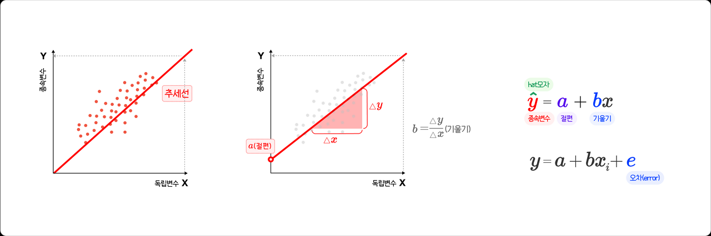

# 5월 9일 학습내용
## 복습
## 회귀분석
- 한번 돌아(일주하여) 원래로 돌아오는 것
### 회귀 분석의 변수
- 원인 : 영향을 주는 변수(X) 독립변수
  - 다른 변수에 영향을 받지 않고 독립적으로 변화하는 수
  - 설명변수, 예측변수 y=f(x)에서 x가 독립변수
- 결과 : 영향을 받는 변수(Y) 종속변수
  - 독립변수의 영향을 받아 값이 변화하는 수
  - 분석의 대상이 되는 수
  - 반응변수, 결과변수
### 기본 회귀분석

- a와 b의 값을 구해주는 것이 회귀분석
- a는 절편이고 x가 0인 상태에서 y와 만나는 추세선 끝자락
- b는 기울기 b=x증가량/y증가량
- 삼각형 모양의 증가한다는 증가분 기호는 델타 기호
- ^hat은 선들을 가리킴
- 소문자 i는 개별 측정값
- e는 오차
### 선형회귀분석
- 선형성
  - 잔차를 적게만드는 것이 목표
- 등분산성
  - 잔차의 일정한 형태
- 정상성
  - 잔차가 대각 직선이면 정규분포

#### 단순선형회귀분석
- 𝑦ᵢ = 𝜷₀ + 𝜷₁𝜷𝑥ᵢ +ℇᵢ, 𝑖 =1,2,...𝑛. ɛ𝑖 ~ 𝜨(0.𝝈²)
- y = b + ax +ℇ (입실론)  
